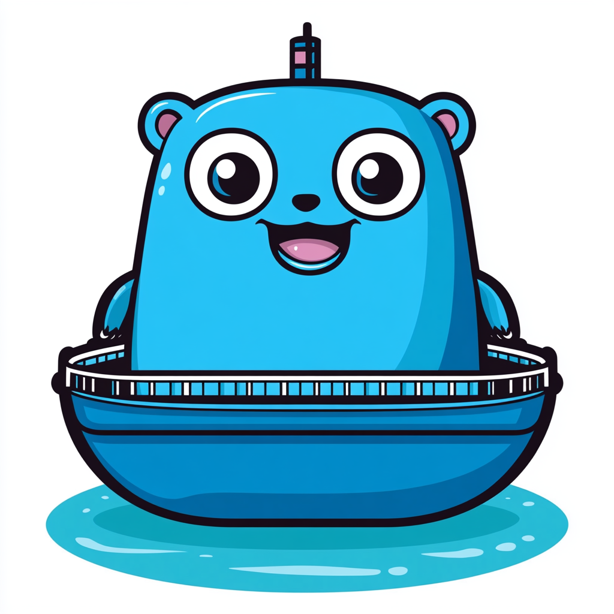

# Ferry

Ferry is a command-line tool for deploying Docker based applications to one or more remote VPS over SSH. It provides a simple way to manage deployments, environment variables, logs, and rollbacks across multiple servers.




## Features

💻 Deploy any application from a Dockerfile
✊ Zero downtime deployment
🌏 High availability and load balancing
🔒 Zero config SSL Certs and auto renewal
🔑 Deploy and update environment variables with SOPS
📄 View logs in real time
🔄 Rollback to previous versions
🚀 One command deployment

## Commands

- logs
- deploy
- rollback
- env

## Installation

```
go install github.com/ronxjansen/ferry@latest
cd ferry
go install
```

## Getting started

Before you can get started, this is what you will need: 

- a Ubuntu LTS VPS with SSH access to it
- Traefik, SOPS and Docker installed on your VPS 
- a git repo with a Dockerfile

That's it!

## Prerequisites

- Go 1.16 or later 
- SSH access to remote servers
- a Ubuntu LTS VPS with SSH access to it


## Contributing

Contributions are welcome! Please open an issue or submit a PR.

## Motivation

Kamal and Sidekick are two major inspirations for writing this tool. Kamal is a great solution, but Ruby based. I am not in the mood to learn Ruby to be able to create custom deployments. Sidekick is the Golang based Kamal alternative, yet very early stage. I've considered to write a few PR's, but considering the scope of changes I wanted to bring, I decided a tool from scratch.

## Roadmap

- [ ] Migrations
- [ ] Rolling update
- [ ] Rollback
- [ ] Better zero downtime deployment (we now only rely on Traefik)
- [ ] Add support for more Linux distros

## Out of scope

At least for the forseeable future, the following features are not in scope:

- VPS provisioning (setting up Traefik, Docker, SOPS, etc.)
- VPS SSH and firewall hardening
- Windows support
- Docker compose support