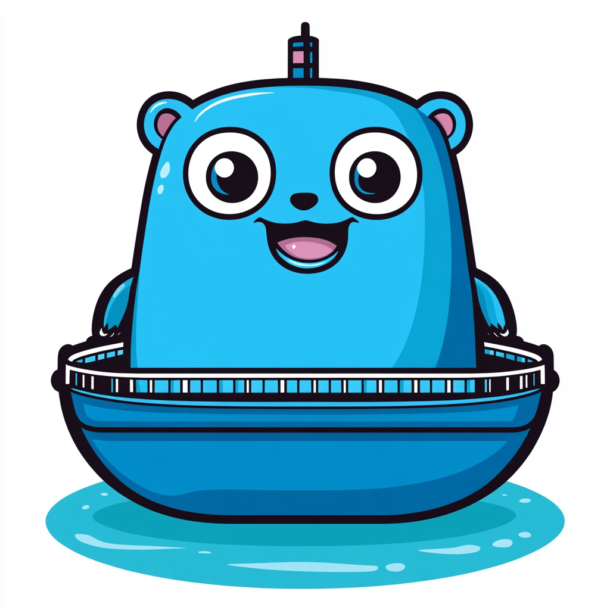

# Ferry

Ferry is a tiny layer on top of Docker, Docker contexts and SSH. Your compose
file stays the source of truth; `ferry.yaml` maps services to VPS IPs and adds
zero-downtime deploys via [kamal-proxy](https://github.com/basecamp/kamal-proxy),
preview environments, and environment variables. A registry is optional —
Docker contexts can build right on the VPS.

<div align="center">
  
  <br>
  
  
  
</div>

## How it works

You already have a compose file that works locally. Ferry gets that exact
setup onto one or more VPSs with HTTPS, zero-downtime deploys, and preview
environments — registry optional, no new service schema to learn.

```yaml
# ferry.yaml — everything else comes from docker-compose.yml
servers:
  vps-1: 165.232.100.10
  vps-2: 165.232.100.11

services:
  web:
    servers: [vps-1]
    domain: example.com
  worker:
    servers: [vps-2]
```

`ferry deploy` with this file reads `docker-compose.yml`, builds `web` **on
vps-1** and `worker` **on vps-2** through their Docker contexts (tagged with
the git SHA), starts them, and hands `web` to kamal-proxy, which health-checks
it, swaps traffic atomically with automatic Let's Encrypt TLS, and drains the
old version. No registry involved. No domain? Set `port` and Ferry falls back
to `web.165-232-100-10.sslip.io`, so first contact needs zero DNS setup.

A compose file with ten services works the same way: list each one under
`services:` with its own `servers:` — same machine, different machines, or
several machines each. Unlisted compose services (mailhog, a local db UI) are
simply not deployed — that's the local/remote split.

The two pillars:

1. **kamal-proxy owns traffic.** `kamal-proxy deploy` blocks until the new
   target passes health checks, then atomically swaps traffic and drains the
   old one. TLS via Let's Encrypt, maintenance mode and request buffering come
   with it. Any failure leaves the running version untouched.
2. **Docker contexts own transport.** Ferry creates a context per server and
   runs real `docker` invocations against it. Builds run natively on the host
   (no `--platform` juggling from Apple Silicon, build cache stays on the VPS
   so repeat deploys are fast), and host-key verification, `~/.ssh/config`,
   jump hosts and agent auth come free from your system SSH. Builds consume
   VPS CPU/RAM — `build.method: pull` is the escape hatch for small hosts or
   CI-built images.

Ferry assumes the link to your servers is flaky and survives it: remote
builds run as detached jobs on the host (a dropped connection — or a killed
terminal — never kills a build; ferry re-attaches and streams the log from
where it left off), every SSH connection carries generous keepalives, short
control commands retry transparently on transient transport errors, and
interrupted pulls resume from the layer cache.

## Installation

```sh
go install github.com/ronxjansen/ferry@latest
```

You need: a VPS you can SSH into (any distro with curl) and a git repo with a
compose file. That's it — `ferry setup` installs Docker and boots the proxy.

## Getting started

```sh
ferry init      # scaffold ferry.yaml from your compose file
ferry setup     # install Docker, create contexts, boot kamal-proxy
ferry deploy    # build on the host, health-gated cutover
ferry ps        # what's running where
```

## Commands

| Command | Description |
|---|---|
| `ferry init` | Scaffold `ferry.yaml` from an existing compose file |
| `ferry setup [server...]` | Provision: Docker via get.docker.com, contexts, kamal-proxy |
| `ferry deploy [service...]` | Deploy (all services in dependency order when none given) |
| `ferry rollback [service]` | Restart the previous retained container — no rebuild |
| `ferry preview` | Deploy a preview env for HEAD at `<sha>.<preview.domain>` |
| `ferry preview list / remove` | Manage previews (discovered from server labels) |
| `ferry ps` | Service, server, version, state, url at a glance |
| `ferry logs <service>` | Logs (`-f`, `--tail`, `--since`, `--server`), interleaved across hosts |
| `ferry exec <service> -- cmd` | Run a command in the service's container |
| `ferry shell <service>` | Interactive shell in the container |
| `ferry ssh <server> [-- cmd]` | Shell or one-off command on the host |
| `ferry run <command>` | User-defined commands from `ferry.yaml` |
| `ferry env push\|diff` | Ship or diff env files (hash-checked, 0600, keys-only diff) |
| `ferry maintenance / live` | Toggle kamal-proxy maintenance mode |
| `ferry config [--json]` | Print the fully resolved config (env values redacted) |
| `ferry lock` | Deploy lock (taken automatically by mutating commands) |
| `ferry audit` | Tail the server-side audit log |
| `ferry proxy init\|status\|logs\|restart` | Manage kamal-proxy |
| `ferry remove <service> [--images]` | Deregister and remove a service |
| `ferry clean [server] -y` | Full teardown |

See [example.ferry.yaml](./example.ferry.yaml) for the full annotated
configuration: proxy options, registry pull mode, sops-age encrypted env
files, health checks, previews with isolated databases, hooks and custom
commands.

## Design principles

1. **Compose is the source of truth.** Ferry never re-invents `image`,
   `build`, `volumes`, `depends_on`, `healthcheck` — it reads them from your
   compose file. `ferry.yaml` only adds what compose cannot express: which
   server, which domain, how the image gets there, previews, hooks, commands.
2. **Delegate, don't reimplement.** Docker contexts own transport and builds;
   kamal-proxy owns health-gating, cutover, drain, TLS. Ferry orchestrates.
3. **Registry optional.** Build on the VPS through the context, or pull from
   a registry. Immutable git-SHA tags either way.
4. **Fail safe, not fail forward.** The proxy refuses to cut over to an
   unhealthy target; failures leave the running version serving. Unproxied
   services restart in place (single-writer stores must not run twice) — a
   brief blip, accepted and documented.
5. **State lives on the server** — retained containers, env files, lock,
   audit log. `ferry.yaml` stays committable and machine-independent.
6. **Unix-y CLI.** One verb per command, non-interactive by default, stable
   stdout for scripting.

Out of scope (deliberately): firewalls (a `ufw` one-liner beats a bad
abstraction — e.g. `ufw allow 80,443/tcp && ufw enable`), load balancers
across VPSs, multi-replica HA, swarm/k8s, registry hosting.

## Cross-server networking

Docker networks don't span hosts. Services on the same server reach each
other by compose service name, exactly like local dev (`db:5432` just
resolves). Across servers, Ferry injects `FERRY_SERVICE_<NAME>_HOST=<ip>`
into every service's environment — connect via env config (`DB_HOST`), the
standard 12-factor pattern. The target service must publish its port in
compose (bind it to a private interface, e.g. `10.0.0.5:5432:5432`, and
firewall it yourself). `ferry config` warns when a `depends_on` edge crosses
servers, since startup ordering is then only best-effort.

## Motivation

[Kamal](https://github.com/basecamp/kamal) and
[Sidekick](https://github.com/MightyMoud/sidekick) are the two major
inspirations. Kamal is great but Ruby-based and re-invents a service schema
your compose file already expresses; Sidekick is early stage. Ferry bets on
the compose file you already have.

## Roadmap

- [ ] We need to keep db services running; now they stop and get restarted like a normal app

## Contributing

Contributions are welcome! Please open an issue or submit a PR.
